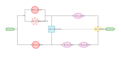
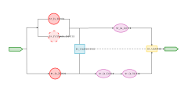

# SKE Course Assignments

This repository contains assignments for the SKE (Survival and Reliability Engineering) course. The assignments involve
statistical analysis of survival data from the Veteran Clinic Trial dataset, including data preparation, elementary
statistics, and parametric/non-parametric modeling using Julia.

## Assignments

### Assignment 01

Introduction to survival analysis concepts, including reliability functions, hazard rates, and censoring.

- **Report**: [01_SKE_diagram.pdf](https://github.com/kunzaatko/SystemsReliabilityAnClinicalExperiments/releases/latest/download/01_SKE_diagram.pdf)

  
&nbsp; &nbsp; 
  
&nbsp; &nbsp;
  

### Assignment 02

Analysis of survival data with Kaplan-Meier estimator, exponential and Weibull distributions, including parametric fitting and goodness-of-fit tests.

- **Report**: [01_SKE_censored_data.pdf](https://github.com/kunzaatko/SystemsReliabilityAndClinicalExperiments/releases/latest/download/01_SKE_censored_data.pdf)

- **(1)** Kaplan-Meier Plot for Group A, **(2)** for Group B

  
&nbsp; &nbsp; &nbsp; &nbsp;
  

- **(3)** Histograms

- **(4)** Histogram vs Parametric Fit for Group A, **(5)** for Group B

  
&nbsp; &nbsp; &nbsp; &nbsp;
  

- **(6)** Histogram vs Weibull Fit for Group A, **(7)** for Group B

  
&nbsp; &nbsp; &nbsp; &nbsp;
  

- **(8)** Log Likelihood Surface for Group A, **(9)** for Group B

  
&nbsp; &nbsp; &nbsp; &nbsp;
  

- **(10)** Nelson-Aalen Plot for Group A, **(11)** for Group B

  
&nbsp; &nbsp; &nbsp; &nbsp;
  

- **(12)** Probability-Probability Plot for Exponential Group A, **(13)** for Group B

  
&nbsp; &nbsp; &nbsp; &nbsp;
  

- **(14)** Probability-Probability Plot for Weibull Group A, **(15)** for Group B

  
&nbsp; &nbsp; &nbsp; &nbsp;
  

- **(16)** Quantile-Quantile Plot for Exponential Group A, **(17)** for Group B

  
&nbsp; &nbsp; &nbsp; &nbsp;
  

- **(18)** Quantile-Quantile Plot for Weibull Group A, **(19)** for Group B

  
&nbsp; &nbsp; &nbsp; &nbsp;
  

