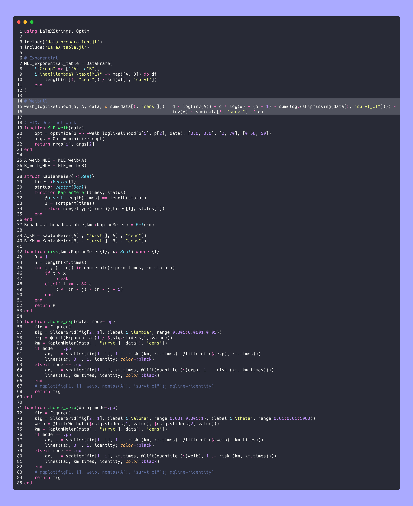

# SKE Course Assignments

This repository contains assignments for the SKE (Survival and Reliability Engineering) course. The assignments involve statistical analysis of survival data from the Veteran Clinic Trial dataset, including data preparation, elementary statistics, and parametric/non-parametric modeling using Julia.

## Assignment 02

Analysis of survival data with Kaplan-Meier estimator, exponential and Weibull distributions.

